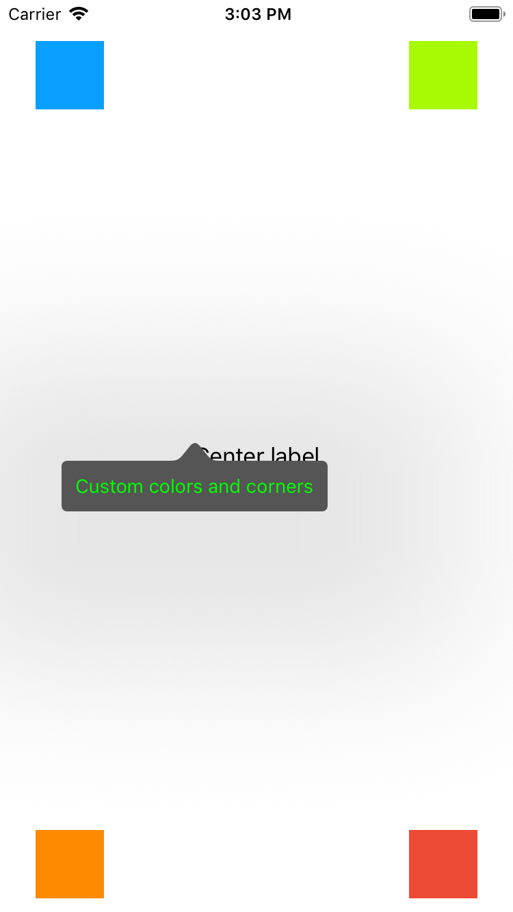
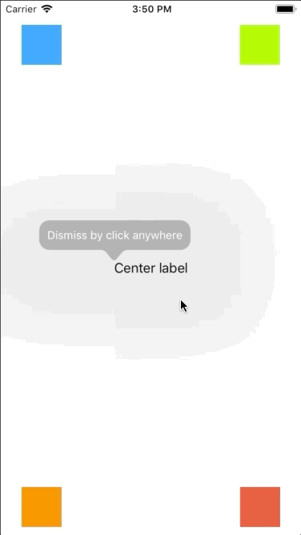
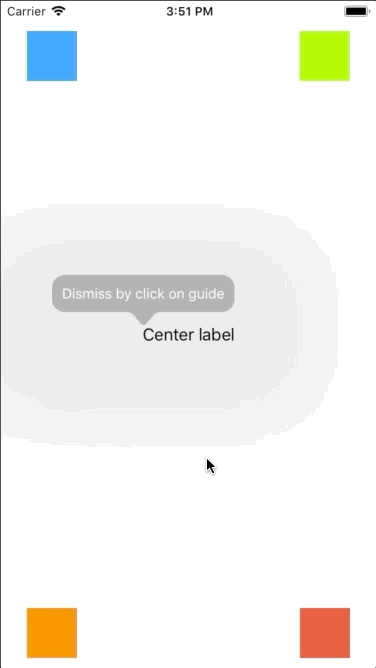

# EasyStartGuide

[](https://travis-ci.org/BardRedStar/EasyStartGuide)
[](https://cocoapods.org/pods/EasyStartGuide)
[](https://cocoapods.org/pods/EasyStartGuide)
[](https://cocoapods.org/pods/EasyStartGuide)


An easy implementation your own application guides into view controllers for iOS written in Swift.
***

# Example

To run the example project, clone the repo, and run `pod install` from the Example directory first.
<p float="left">
   
   
    
   
</p>

# Requirements

* Swift 4+
* iOS 9+

# Installation

EasyStartGuide is available through [CocoaPods](https://cocoapods.org). To install
it, simply add the following line to your Podfile:

```ruby
pod 'EasyStartGuide'
```

# Usage

## Basic usage

1. Get an instance of EasyStartGuide and create array of lessons. Lesson will be linked to a view, which you have passed to the lesson params (e.g. targetView)

```swift
let easyStartGuideInstance = EasyStartGuide.instance
let lessons = [EasyStartGuide.GuideLesson(view: targetView, text: "My first lesson!")]
```
2. Start tutorial using view controller instance and array of lessons:

```swift
easyStartGuideInstance.startTutorial(in: viewController, withLessons: lessons)
```
And that's it!

## Optional parameters

You can add optional parameters to the each lesson and to the whole tutorial.

### Local parameters

Local parameters can be added to the each lesson object individually. There are location of lesson and direction of lesson arrow.

#### Location

As said above, this option sets the position of the arrow pointer and coordinates common location of lesson view.
To set the location you should add a parameter into the GuideLesson constructor:
```swift
EasyStartGuide.GuideLesson(view: targetView, text: "My first lesson!", location: .topLeft)
```
Possible values:
+ Corners
+ `.topLeft` - Top-left corner (default value)
+ `.topRight` - Top-right corner
+ `.bottomLeft` - Bottom-left corner
+ `.bottomRight` - Bottom-right corner
+ Centers of sides
+ `.topCenter` - Center of the top side
+ `.bottomCenter` - Center of the bottom side
+ `.leftCenter` - Center of the left side
+ `.rightCenter` - Center of the right side
+ `.center` - Center of the view
+ `.custom(x: CGPoint, y: CGPoint)` - Custom point from the top-left corner


<details>
<summary> :camera: Preview </summary>
<p float="left">
  
  
  
  
  
  
  
  
  
  
</p>
</details>

***

#### Arrow direction

The option, which defines permitted directions of lesson view arrow.
To set the arrow direction use the corresponding parameter:
```swift
EasyStartGuide.GuideLesson(view: targetView, text: "My first lesson!", arrowDirection: .up)
```
Possible values:
* `.up` - Only upward arrow
* `.down` - Only downward arrow
* `.left` - Only right-to-left arrow
* `.right` - Only left-to-right arrow
* `.any` - Any arrow direction (default value)


<details>
<summary> :camera: Preview </summary>
<p float="left">
  
  
  
  
</p>
</details>

***

### Global parameters

Global parameters can be added globally for the current EasyStartGuide instance. They affect the whole tutorial and cannot be modified when the tutorial in progress.

To set the global parameters to the instance, you should set the ```options``` property. For example:
```swift
easyStartGuideInstance.options = [.backgroundColor(UIColor.lightGray), .cornerRadius(5.0)]
```

***

#### Background color

The color of the lesson view background including arrow color. The default value is UIColor.lightGray. 

Usage: 
```swift 
.backgroundColor(UIColor.darkGray) 
```

***

#### Text color

The color of the lesson text. The default value is UIColor.white. 

Usage: 
```swift 
.textColor(UIColor.black) 
```
> :heavy_exclamation_mark: **NOTE:** 
>
> If you set the custom view parameter, the text color won't work with it!

***

#### Corner radius

The corner radius of the lesson view.

Usage: 
```swift 
.cornerRadius(5.0) 
```
> :heavy_exclamation_mark: **NOTE:** 
>
> For some reasons it cannot be greater than 13.0 and less than 0.0. Greater value won't affect the view.


<details>
<summary> :camera: Preview </summary>
<p float="left">
  
</p>
</details>

***

#### Custom view

This parameter provides the custom view which the lesson view will based on. The custom view **necessarily** should has a label view to print text on it. Background color and text color of the lesson will be applied from the custom view properties.

Usage: 
```swift 
.customView(containerView: view, label: label)  // view and label are the existing vews
```
> :heavy_exclamation_mark: **NOTE:** 
>
> Container view should be with detemined width and height!


<details>
<summary> :camera: Preview </summary>
<p float="left">
  
</p>
</details>

***

#### Dismiss mode

The action which will dismiss the lesson view.

Usage: 
```swift 
.dismissMode(.byClickAnywhere) 
```

Possible values:
* `.byClickAnywhere` - Dismisses lesson after click in any place on the screen
* `.byClickOnGuide` - Dismisses lesson only after click on lesson view (default value)

> :heavy_exclamation_mark: **NOTE:** 
>
> This parameter has a great compatibility with the customView and it won't dismiss the lesson even after click on button on the custom view.


<details>
<summary> :camera: Preview </summary>
<p float="left">
  
  
</p>
</details>

# Author

BardRedStar, den.kovalev999@gmail.com

# License

EasyStartGuide is available under the MIT license. See the LICENSE file for more info.
